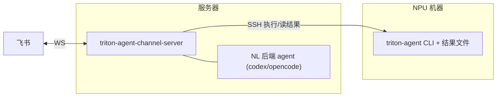
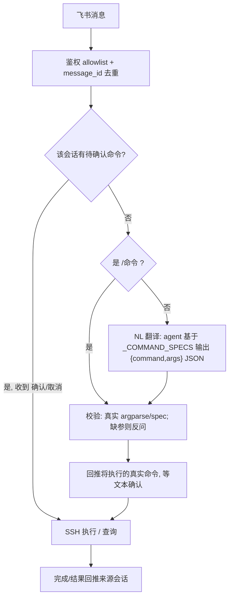
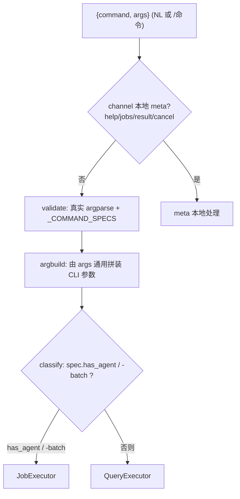
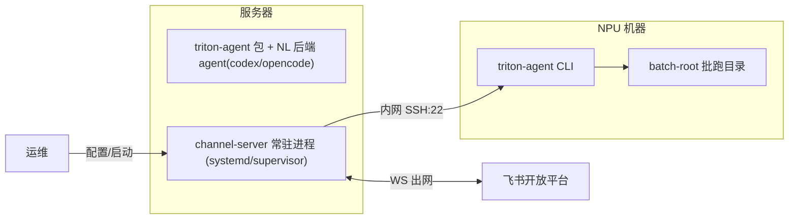

## Channel 集成方案（飞书 + 自然语言 + 跨机 SSH 执行）

### 决策回顾（已与用户确认）
- 范围: 仅飞书 (Feishu/Lark) 完整实现，预留可扩展 channel 抽象层（微信仅留接口占位）。
- 接入: 飞书 WebSocket 长连接 (`lark-oapi` 的 `lark.ws.Client`)，仅需出网能力。
- 架构: 独立服务 `services/triton-agent-channel-server/`，依赖 `triton-agent` 包以复用命令契约（`_COMMAND_SPECS`）与后端 agent；不侵入核心 `src/triton_agent/`。
- 跨机: NPU 机器不可出网，channel 服务部署在可出网的服务器，通过 **SSH** 登入 NPU 机器执行命令与读取结果（设计 A）。
- 自然语言: 复用服务器上已安装的 triton-agent 后端 agent（codex/opencode 等）做**无状态一次性** NL→结构化命令翻译，覆盖**全部子命令**（不做多轮上下文，见范围边界）。
- 确认: 纯文本「确认/取消」，每会话用**内存态**待确认命令状态机（不持久化）。
- 入口双轨: 自然语言（主）+ 显式 `/命令`（power user / NL 不可用时回退）。

### 跨机拓扑



注：channel 服务运行在可出网的服务器；triton-agent CLI 与所有批跑结果文件都在内网 NPU 机器上，channel 服务只通过 SSH 对接 NPU 机器。triton-agent 自身可选用 `--remote/--remote-workdir` 把测试/bench 分流到其它 NPU 机器（见 `src/triton_agent/execution.py` 的 `run_remote_test`/`run_remote_bench`、`src/triton_agent/cli.py:441`），该机制与 channel 无关。

### 入站到执行全链路



### 通用命令路由（契约单源，避免第二份命令表）

channel 侧不为每个 triton-agent 子命令写 handler，也不维护第二份路由映射。命令一律抽象为 `{command, args}`，按下图通用处理；执行模式从 `_COMMAND_SPECS` 元数据派生，新子命令进入 `_COMMAND_SPECS` 后 channel 自动支持。



- 依据现有字段：`has_agent=True`（跑代码 agent 的长循环，如 `optimize*`/`gen-*`/`convert*`/`log-check*`）或命令名以 `-batch` 结尾 → `JobExecutor`（分离启动 + 轮询退出标记 + 完成回推）；其余（`status`/`report*`/`compare-*` 等）→ `QueryExecutor`（短 SSH exec + 渲染）。
- `JobExecutor` 通用：`nohup sh -c 'triton-agent <args>; echo $? > <run>/exit.code' > run.log 2>&1 &`，轮询 `exit.code` 判完成；对 optimize-batch 额外叠加 `optimize-batch-status.json` 进度（可选增强，按命令名启用，不影响通用路径）。
- 唯一保留的少量 per-command 知识是**结果渲染**（`render/results.py` 为 `status`/`report-batch` 的 JSON 做漂亮展示），未知命令回退为「直接转发 stdout 文本」——属渲染而非路由。

### 参考 openclaw 的分层映射
- openclaw `ChannelPlugin` 窄接口 → `channel/base.py` 的 `Channel` ABC + `InboundMessage`/`ReplyTarget`。
- openclaw `gateway.startAccount` → `runtime.py` 的 `ChannelRuntime` 启停 channel。
- openclaw `channel.inbound.run`(鉴权→路由→派发) → `inbound` + `commands/dispatch.py`。
- openclaw `reply-dispatcher`(分块/typing) → `channel/feishu/outbound.py`。
- openclaw `bindings`/allowlist → `security.py`（飞书 open_id/chat_id 白名单）。

### 新服务目录结构（镜像 `services/triton-agent-upload-server/`）
```
services/triton-agent-channel-server/
├── pyproject.toml              # deps: lark-oapi, paramiko, triton-agent (本地源[tool.uv.sources] path=../.. editable; + 清华源)
├── README.md                   # 飞书应用配置 / SSH 配置 / 运行说明
├── src/triton_agent_channel_server/
│   ├── app.py                  # main(): 构建 runtime, 启动 channels, 阻塞运行, 优雅退出
│   ├── config.py               # AppConfig + argparse/env
│   ├── runtime.py              # ChannelRuntime: 持有 JobManager / NL / SSH / channels, 统一派发
│   ├── channel/
│   │   ├── base.py             # Channel ABC; InboundMessage / ReplyTarget / OutboundPayload
│   │   ├── registry.py         # 按 id 注册/获取 channel (扩展点, 微信占位)
│   │   └── feishu/
│   │       ├── channel.py      # EventDispatcherHandler + ws.Client(独立线程) + lark.Client
│   │       ├── inbound.py      # P2ImMessageReceiveV1 -> InboundMessage
│   │       └── outbound.py     # 发送文本, 超长分块
│   ├── nl/
│   │   ├── schema.py           # 渲染 triton_agent._COMMAND_SPECS -> LLM 可读命令 schema (全命令)
│   │   ├── translator.py       # create_runner+AgentRequest 无状态一次性翻译, 提取/解析 JSON
│   │   └── prompts.py          # NL->{command,args} 的结构化输出提示词
│   ├── commands/
│   │   ├── parser.py           # 显式 /命令 解析 (含 channel 本地 meta: help/jobs/result/cancel)
│   │   ├── validate.py         # 用真实 argparse/_COMMAND_SPECS 校验结构化命令, 报缺失参数
│   │   ├── argbuild.py         # 由校验后的 {command,args} 通用拼装 triton-agent CLI 参数串
│   │   ├── classify.py         # 由 _COMMAND_SPECS 元数据(has_agent / -batch) 派生执行模式
│   │   ├── confirm.py          # 内存态待确认命令状态机 (确认/取消/超时)
│   │   ├── dispatch.py         # 薄路由: 本地 meta -> meta.py; 否则按模式选 executor
│   │   └── meta.py             # channel 本地命令 help/jobs/result/cancel
│   ├── executors/
│   │   ├── job.py              # 长任务模式: 分离启动+退出标记轮询(+可选 status.json 进度)+完成回推
│   │   └── query.py            # 短读模式: SSH exec + 渲染(默认转发文本; status/report 走结构化渲染)
│   ├── render/
│   │   └── results.py          # status/report-batch 的 JSON -> 飞书文本渲染 (未知命令回退转发原文)
│   ├── jobs/
│   │   ├── models.py           # Job, JobStatus(queued/running/succeeded/failed)
│   │   ├── manager.py          # 后台轮询 SSH 任务状态, 完成回推
│   │   └── store.py            # job 注册表持久化 JSON
│   ├── ssh_bridge.py           # paramiko: 后台分离启动 + 状态轮询 + 短命令 exec + 读远端文件
│   └── security.py             # allowlist 鉴权 + 路径越界/命令白名单
└── tests/
```

### 关键实现要点

1. 飞书接入 (`channel/feishu/channel.py`)
   - 收: `lark.EventDispatcherHandler.builder(encrypt_key, "").register_p2_im_message_receive_v1(cb).build()` + `lark.ws.Client(app_id, app_secret, event_handler=handler)`；`start()` 阻塞，放 daemon 线程（SDK 自带事件循环，必须独立线程）。
   - 发: 独立 `lark.Client.builder().app_id().app_secret().build()` + `im.v1.message.create`（WS 客户端只能收不能发）。
   - 去重: 按飞书 `message_id` 去重。
   - **回调不阻塞**：事件回调内只做去重 + 入队，交 worker 线程池处理 NL/SSH，避免卡住 WS 接收。
   - **消息类型**：仅处理文本（`text`/`post` 取纯文本），群聊剥离 @bot mention 再解析；图片/文件等其他类型礼貌回复「仅支持文本指令」。

2. 自然语言翻译 (`nl/`)
   - `schema.py` 读取 `triton_agent` 的 `_COMMAND_SPECS`/`CommandKind`，渲染成紧凑命令清单（命令名、参数、取值域），实现「契约单源」。
   - `translator.py` 复用 `triton_agent.backends.factory.create_runner(nl_agent)` + 构造 `AgentRequest`（关闭 hooks、`enable_agent_hooks=False`、`log_tools=False`、空临时 workdir，**无状态一次性调用**），prompt 要求**只输出 JSON `{command, args}`、不调用任何工具、不读写文件**；从 `AgentResult.stdout` 稳健提取 fenced JSON。
   - 设较短 stall/超时；超时或解析失败/无 agent 时回退到显式 `/命令`。
   - 备注（已知权衡）：用重型 code agent 做意图解析延迟较高（数十秒）且非确定性，靠「强约束 prompt + 真实 argparse 校验 + 文本确认」三重兜底保证安全。

3. 命令校验与确认 (`commands/validate.py` + `confirm.py`)
   - 用真实 argparse（`build_parser`）或 spec 校验结构化命令；缺参在会话内反问澄清。
   - 校验通过后回推**将执行的真实命令字符串**，进入待确认状态；收到「确认」才执行，「取消」或超时则丢弃。

4. 跨机执行 (`ssh_bridge.py` + `executors/job.py` + `executors/query.py` + `jobs/manager.py`)
   - 长任务模式 (`JobExecutor`)：SSH 在 NPU 机器以**分离方式后台启动**（`nohup sh -c '... ; echo $? > exit.code' > run.log 2>&1 &`），不长时占用 SSH 通道；`JobManager` 后台轮询 `exit.code` 判完成，对 optimize-batch 额外读 `optimize-batch-status.json` 上报进度，完成后回推汇总（退出码 + completed/incomplete/失败列表）。
   - 短读模式 (`QueryExecutor`)：`status`/`report-batch` 等直接 SSH `exec` 等待返回。
   - **重启恢复**：JobManager 启动时读 `jobs/store`，对未完成 job 重新挂载轮询（NPU 上 detached 进程仍在跑），避免重启丢失在途任务。
   - **同 root 互斥**：已有运行中 job 指向同一 `batch_root` 时拒绝新建（避免 optimize-batch 状态文件/resume 冲突）；总并发受 `--max-jobs` 限制。

5. 结果数据分析与渲染 (`render/results.py`)
   - 查询/分析优先走**只读路径**：QueryExecutor 直接 SSH 读远端稳定 JSON（`optimize-batch-status.json` 进度、`report-batch-state.json` 的 `summary` + 每 workspace optimize/verify/check/pattern 摘要），**不触发 triton-agent 运行**，渲染为飞书文本。
   - 仅当用户显式要求「重新生成报告」时才以 Job 方式 SSH 跑 `report-batch`；未知命令回退为直接转发 stdout。

6. 配置与密钥 (`config.py`，镜像 upload-server argparse + 默认值)
   - 飞书: `--app-id`、`--app-secret`(env 优先)、`--encrypt-key`、`--allowlist`。
   - SSH: `--ssh-host`(NPU 机器)、`--ssh-port`、`--ssh-user`、`--ssh-key`、远端 `triton-agent` 可执行路径。
   - 业务: `--batch-root`(允许基目录)、`--nl-agent`(默认 codex 或 opencode)、`--max-jobs`、确认超时、`--dry-run`(只回显将执行命令、不真正 SSH 执行，供联调)。
   - 密钥优先环境变量，不写入仓库。

### 安全与健壮性

- **参数注入防护**：`argbuild` 对每个参数 `shlex.quote`；优先以 argv 列表经 paramiko `exec_command` 传递，长任务的 `nohup sh -c` 包装也对内层命令整体转义，杜绝 `;`/`$()`/反引号注入。
- **命令/flag 白名单**：默认仅放行只读与批跑类（`optimize`/`optimize-batch`/`status`/`report`/`report-batch`/`compare-*`）；破坏性 flag（如 `--reset-optimize`/`--force-overwrite`）默认禁用或需二次确认；**禁止透传 `--remote`/`--remote-workdir`**（防越机）。白名单与禁用项可配置。
- **鉴权 fail-closed**：`--allowlist` 为空即拒绝所有；仅白名单 `open_id`/`chat_id` 可用，非白名单礼貌拒绝并记日志。
- **路径约束**：`batch_root` 经 `realpath` 归一后必须落在 `--batch-root` 内（防 `..`/软链越界）。
- **审计日志**：结构化记录 who（open_id）/when/原始消息/解析出的命令/确认动作/job 退出码，便于追溯与排障。

### 文档（遵循 AGENTS.md）
- 先写设计文档 `docs/specs/2026-05-29-channel-feishu-design.md`（用户可见语义优先：拓扑、NL、确认、安全）。
- 运行/配置说明写新服务 `README.md`，并在仓库根 `README.md` 增加服务条目。
- channel 是新服务而非新 skill，无需改 `skill_staging.py`。

### 部署方案



1. 服务器（可出网）准备
   - Python 3.11+ 与 `uv`；进入服务目录 `uv sync` 安装依赖（`lark-oapi`/`paramiko`/`triton-agent`）。
   - 安装并登录一个后端 agent CLI（`codex` 或 `opencode`）供 NL 翻译使用（与 `--nl-agent` 一致）。
2. 飞书开放平台配置
   - 创建企业自建应用，开启机器人能力；事件订阅方式选「使用长连接接收事件」（无需公网回调地址）。
   - 订阅事件 `im.message.receive_v1`；申请发消息权限 `im:message`。
   - 记录 `app_id`/`app_secret`（如启用加密再记 `encrypt_key`），通过环境变量注入，不写入仓库。
3. SSH 通道
   - 服务器生成 SSH key 并加入 NPU 机器 `authorized_keys`，验证免密登录。
   - NPU 机器上确认 `triton-agent` 可执行、`batch-root` 目录存在、支持后台运行（`nohup`/`screen`/`tmux` 任一）。
4. 启动与守护
   - `uv run triton-agent-channel-server --app-id ... --ssh-host ... --ssh-user ... --ssh-key ... --batch-root ... --nl-agent codex --allowlist <open_id...>`。
   - 推荐用 systemd/supervisor 守护常驻，密钥经环境变量传入；服务器仅需出网访问飞书，到 NPU 机器走内网 SSH。
   - 部署与配置步骤同步写入新服务 `README.md`。

### 本地验证（静态检查 + 单测）
- channel 子项目内 `uv run --group dev ruff check`、`uv run pyright`、`uv run python -m pytest -q --tb=short --no-header -p no:warnings tests/`。
- 单测 mock `lark` SDK / paramiko SSH / 后端 agent：覆盖 NL 解析与校验、缺参反问、确认状态机、路径越界与命令白名单、job 生命周期与完成回推。

### 端到端测试方案
为便于安全联调，`config.py` 提供 `--dry-run`（只回显将执行的命令、不真正 SSH 执行）开关。按阶段推进：

1. 干跑链路（无飞书/无 SSH）：本地起服务并开 `--dry-run`，用脚本注入模拟飞书消息，验证「NL→结构化命令→校验→确认回显」与显式 `/命令` 两条路径，以及缺参反问、取消/超时。
2. SSH 连通性：关闭 dry-run，用最轻量只读命令（如 `triton-agent status -i <预置小 batch>`）验证 SSH `exec`、远端文件读取与结果渲染。
3. 飞书联调：连真实飞书应用，私聊机器人发 `/help`，确认 WS 收发正常、allowlist 生效（非白名单用户被拒）。
4. 小规模真实批跑：在 NPU 机器准备含 1-2 个 workspace 的最小 `batch-root`；飞书发自然语言（如「帮我把 xxx 批跑一下，最少 3 轮，并发 1」）→ 确认 → 观察后台分离启动、进度轮询上报、完成回推汇总（退出码 + 各 workspace 状态）。
5. 查询与分析：发 `/status`、`/report` 及自然语言查询，核对回推内容与直接在 NPU 机器跑 `triton-agent status`/`report-batch` 的 `report-batch-state.json` 一致。
6. 异常与鲁棒性：参数注入（含 `;`/`$()` 的路径被安全转义/拒绝）、路径越界拒绝、命令/flag 白名单拦截、非白名单用户拒绝、SSH 断连重试、agent 输出非 JSON 的容错回退、NL 超时回退 `/命令`、同 root 互斥、服务重启后从 store 重新挂载在途 job 并 `/jobs` 可查。

验收标准：阶段 1-2 可在 CI/本地自动化（mock + dry-run）；阶段 3-6 为人工冒烟，需用户提供飞书测试应用与 NPU 机器 SSH 凭证，结果记录到 `docs/notes/` 的日期前缀笔记中。

### 范围边界（本期不做）
- 微信仅预留 `channel/registry.py` 扩展点与 `Channel` ABC，不实现具体平台。
- 不引入 Webhook 入站模式（抽象层保留可加，MVP 只做 WS）。
- 不做飞书交互式卡片按钮确认（用纯文本确认）。
- 不在 channel 服务里重做执行/评估逻辑，全部通过 SSH 调 NPU 机器的 triton-agent CLI。
- 不改动核心 `src/triton_agent/`（含 `backends`），全部新增逻辑落在 `services/` 子项目内。
- **会话管理与多轮对话历史（本期不做）**：NL 为无状态一次性翻译，不持久化对话历史、不复用 agent 原生会话、不支持跨轮上下文引用（如「再跑一次/并发改成 2」需在同一条消息里把参数说全）；待确认命令状态仅内存态，服务重启即丢。后续如需，可再引入 `session/` store + 核心后端通用会话续接（`AgentRequest.resume_session_id` + codex/opencode/claude 原生 flag）。
