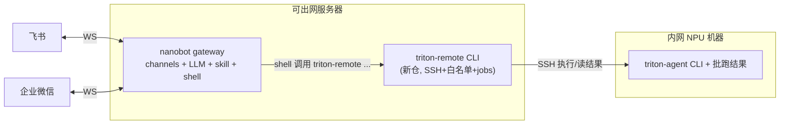

# Nanobot 飞书/企微 ChatOps 独立仓方案

## 决策回顾（已与用户确认）

- 拓扑: 跨机 SSH。nanobot 网关部署在可出网服务器，triton-agent CLI 与批跑结果都在内网 NPU 机器，经 SSH 执行/读取。
- 渠道: 飞书 (Feishu) + 企业微信 (WeCom 智能机器人, WS 长连接)，预留其他平台（改 nanobot 配置即可）。
- 集成方式: 基于 nanobot 的 skill + shell + 文本确认，不用 MCP。
- 代码归属: 全新独立仓库，不在当前 `triton-agent` 项目内实现，也不改动 `src/triton_agent/`。

## 核心设计: 用薄包装命令兜住 SSH 与长任务

纯 shell 让 LLM 直接拼 `ssh npu 'triton-agent ...'` 在跨机 + 长批跑场景下很脆（SSH 串难白名单、长任务撑爆 shell timeout）。方案改为: nanobot 的 shell 工具永远只调用一个本地命令 `triton-remote <subcommand> <args>`，由它在 Python 里完成 SSH、白名单、`shlex.quote`、后台 job 管理。LLM 不接触 SSH 串。

这样既保留 skill+shell 的简单（nanobot 侧零执行逻辑、只配 `allow_patterns`），又把跨机/安全/长任务收进可控的小 CLI。该 CLI 逻辑后续若需要可零改写地再暴露成 MCP，但 V1 不做。




## 入站到执行链路

```mermaid
SSHflowchart TB
  Msg["飞书/企微消息"]
  Auth["nanobot allowFrom 白名单(fail-closed)"]
  Agent["nanobot agent: 读 SKILL.md"]
  Kind{"执行类还是查询类?"}
  Confirm["回显将执行的 triton-remote 命令, 等文本确认"]
  Shell["shell 调用 triton-remote (allow_patterns 二次白名单)"]
  TR["triton-remote: 白名单+argv转义+SSH"]
  Reply["渲染结果/返回 job_id 回推"]
  Msg --> Auth --> Agent --> Kind
  Kind -->|"执行类(optimize* 等)"| Confirm --> Shell
  Kind -->|"查询类(status/report)"| Shell
  Shell --> TR --> Reply
```


## 新仓目录结构（暂名 triton-agent-chatops）

- `pyproject.toml`: 依赖 `paramiko` + `triton-agent`(仅用于读命令契约与参数校验, editable/私有源; 清华源)，uv 管理，参考现有 `services/triton-agent-upload-server` 的 pyproject 风格。
- `README.md`: 飞书/企微应用配置、SSH 免密配置、nanobot 安装与配置、端到端步骤。
- `nanobot/config.example.json`: nanobot 配置样例（见下）。
- `skills/triton-agent/SKILL.md`: 由脚本从 `_COMMAND_SPECS` 生成，教 agent 如何调用 `triton-remote` 及确认话术。
- `src/triton_remote/`
  - `cli.py`: `triton-remote` argparse 入口；子命令镜像 triton-agent；执行类返回 `job_id`，查询类直接渲染。
  - `specs.py`: 从 `triton_agent` 导入 `_COMMAND_SPECS`/`CommandKind`，输出命令目录与每命令的参数/模式（`has_agent`、`-batch`、`has_force_overwrite` 等）。
  - `security.py`: 命令白名单 + flag 白/黑名单（默认禁 `--reset-optimize`/`--force-overwrite`，禁透传 `--remote`/`--remote-workdir`）、`shlex.quote` 拼 argv、`batch_root` realpath 越界校验、审计日志。
  - `ssh_bridge.py`: paramiko；短命令 exec（查询）、`nohup sh -c '...; echo $?>exit.code' &` 分离启动（长任务）、读远端 JSON 文件。
  - `jobs.py`: job 注册表 JSON 持久化；start/poll/list/result；进程重启后对在途 job 重新挂载轮询。
  - `render.py`: `status`/`report-batch` 的 JSON -> 飞书/企微文本；未知输出回退转发 stdout。
  - `config.py`: env/argparse —— SSH host/port/user/key、远端 `triton-agent` 路径、`--batch-root`、`--max-jobs`、`--dry-run`。
- `scripts/gen_skill.py`: 从 `_COMMAND_SPECS` 生成 `skills/triton-agent/SKILL.md`（契约单源，避免手写漂移）。
- `tests/`: 单测（mock paramiko/specs）。

## 契约单源

新仓把 `triton-agent` 作为依赖，仅用于: 1) 生成 SKILL.md；2) 发 SSH 前用真实 spec 校验参数、拦截非法命令/flag。执行仍走 NPU 机器的 triton-agent。契约来源是现有 [src/triton_agent/cli.py](src/triton_agent/cli.py) 的 `_COMMAND_SPECS`(第 164 行) 与 `_CommandSpec`(第 133 行)、[src/triton_agent/models.py](src/triton_agent/models.py) 的 `CommandKind`。若 nanobot 机器不便安装 triton-agent，回退方案: 在有 triton-agent 的机器上运行 `gen_skill.py` 产出 `command_catalog.json` 随仓提交。

## nanobot 配置要点（nanobot/config.example.json）

- `channels.feishu`: `enabled/appId/appSecret/allowFrom(open_id, fail-closed)/groupPolicy=mention`。
- `channels.wecom`: `enabled/botId/secret/allowFrom`（WS 长连接，无需公网）。
- `tools.exec`: `enable=true`、`timeout=0`、`allow_patterns=["^triton-remote "]`（只放行本地包装命令）、`deny_patterns` 兜底破坏性词。
- `providers`: 配一个 LLM（如 deepseek，key 走环境变量）；`agents.defaults.model/workspace`。
- 密钥一律环境变量，不写入仓库。

## 确认与安全（双层）

- 软确认: SKILL.md 要求 agent 对执行类命令（`optimize*`/`gen-*`/`convert*`/`log-check*`/`*-batch`）先回显完整 `triton-remote` 命令并等用户「确认」；查询类（`status`/`report*`/`compare-*`）可直接执行。
- 硬边界: nanobot `allow_patterns` 只允许 `^triton-remote` ；`triton-remote` 内部命令/flag 白名单 + `shlex.quote` + argv 传参 + `batch_root` realpath 越界校验 + 禁 `--remote` 透传。即使 LLM 跳过确认，也越不出白名单与只读/批跑边界。

## 长任务处理

- 执行类: `triton-remote optimize-batch ...` 立即返回 `job_id`（NPU 上分离启动），不占 shell；用户问进度时 agent 调 `triton-remote jobs` / `triton-remote result <id>`，对 optimize-batch 额外读 `optimize-batch-status.json`。
- 可选增强: 用 nanobot cron 定时检查在途 job 并主动回推完成消息（V1 可不做）。

## 部署步骤（写入 README）

1. 服务器(可出网): 装 Python3.11+/uv、`uv sync` 装本仓依赖、`pip/uv` 安装 nanobot、配一个 LLM provider。
2. 飞书: 建企业自建应用、开机器人、事件订阅选长连接、订阅 `im.message.receive_v1`、申请 `im:message`，记录 app_id/secret。
3. 企微: 管理后台建智能机器人、长连接模式、取 botId/secret。
4. SSH: 服务器生成 key 加入 NPU 机器 authorized_keys，验证免密；确认远端 triton-agent 可执行、batch-root 存在、支持 nohup。
5. 生成 skill: 运行 `scripts/gen_skill.py` 产出 `skills/triton-agent/SKILL.md`，放入 nanobot 技能搜索路径。
6. 启动: 配好 `~/.nanobot/config.json` 后 `nanobot gateway`；推荐 systemd/supervisor 守护。

## 测试方案

- 单测(CI): mock paramiko/specs，覆盖命令/flag 白名单、`batch_root` 越界、argv 注入转义、job 生命周期与重启重挂、`--dry-run` 回显。
- 人工冒烟: 飞书发 `/help` 与自然语言；非白名单用户被拒；小规模批跑（确认->job_id->进度->完成汇总）；查询渲染与 NPU 上 `report-batch-state.json` 一致；注入/越界/超长消息鲁棒性。

## 范围边界（V1 不做）

- 不做 MCP（保留后续把 triton-remote 逻辑再暴露成 MCP 的可能）。
- 不做交互式卡片按钮确认（纯文本）。
- 不做多轮上下文/会话持久化的复杂续接（依赖 nanobot 自带能力）。
- 个人微信暂不接（合规/封号风险），如需再评估。
- 不修改 `src/triton_agent/`。

